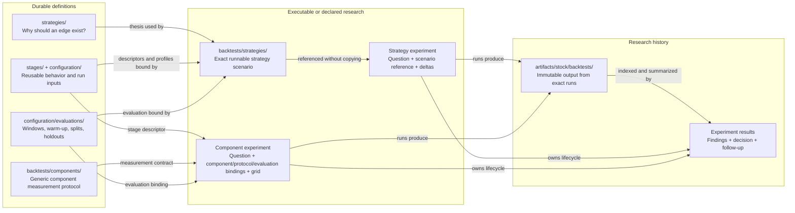

# Tradix

Tradix is a local research workspace for market-data collection, feature
engineering, falsifiable trading-strategy research, reusable performance
components, and backtesting.

This README is the repository entry point. Detailed contracts and command
references live in the linked subsystem documentation.

## Quick Start

### Prerequisites

- Git
- Python 3.7 or newer
- Network access when fetching public market data
- Optional: rclone for Backblaze B2 snapshot storage
- Optional: systemd and `flock` for automatic B2 mirroring

The repository uses Python's standard library and shell scripts; there is no
package-install step.

```sh
git clone YOUR_TRADIX_REPOSITORY_URL
cd Tradix
python3 -m unittest discover -s tests -p 'test_*.py'
```

`data/` and `artifacts/` are intentionally excluded from Git. Build the local
dataset or restore a snapshot before running data-dependent research.

### Build Local Data

Fetch canonical daily prices for the required instruments:

```sh
python3 scripts/market-data-fetchers/backfill_daily_stock_prices.py \
  2024-01-01 2026-07-21 \
  --symbol SPY \
  --symbol NVDA
```

Generate derived daily features:

```sh
python3 scripts/stock-data-enrichment/precompute_daily_stock_features.py \
  --symbol SPY \
  --symbol NVDA
```

Analyst activity is optional:

```sh
python3 scripts/market-data-fetchers/fill_analyst_activity.py \
  --start-date 2024-01-01 \
  --end-date 2026-07-21 \
  --symbol NVDA
```

Canonical datasets live under:

```text
data/stock/prices/daily/<year>/<ticker>.csv
data/stock/features/daily/<year>/<ticker>.csv
data/stock/analysts/activity/<year>/<ticker>.csv
```

Read each dataset's `.notes` file before analysis. Provider behavior, merge
semantics, intervals, and additional commands are documented in
[Market Data Fetchers](scripts/market-data-fetchers/README.md) and
[Stock Data Enrichment](scripts/stock-data-enrichment/README.md).

The backtest driver does not yet fetch missing instruments automatically.
Persist required prices into the canonical dataset and regenerate features
before relying on derived indicators.

### Restore a B2 Snapshot

To restore an existing Backblaze B2 snapshot:

```sh
rclone config
scripts/setup-b2-sync.sh
scripts/b2-storage.sh verify
```

Only one computer should operate as the authoritative automatic mirror. Use
`scripts/setup-b2-sync.sh --no-timer` for a non-authoritative restored clone.
Credentials belong in rclone's per-user configuration, never in Git or
`.b2.env`.

See [B2 Storage and Recovery](scripts/B2-STORAGE.md) for remote configuration,
authority transfer, safety controls, reconciliation, repair, and recovery.

After either bootstrap path, validate repository definitions and local inputs:

```sh
python3 tests/validation/validate_static_profiles.py
```

## Research Model

A strategy is a falsifiable thesis about market behavior and predictability,
not merely a valid pipeline or arbitrary combination of components. Every
strategy follows the same decision sequence:

```text
trigger
→ universe resolution
→ market-data resolution
→ selection
→ optional setup evaluation
→ portfolio transition
→ execution
```

## Canonical Terminology

| Term | Meaning |
| --- | --- |
| Stage descriptor | A version-controlled reusable component contract under `stages/`, including behavior, declared parameters, and defaults. |
| Implementation | Executable code that realizes a stage descriptor. |
| Configuration profile | A reusable declarative, non-component run input under `configuration/`, such as a static universe or funding profile. |
| Stage instance | One stage descriptor plus parameter values resolved for a scenario or run. |
| Strategy scenario | A complete executable strategy-backtest specification under `backtests/strategies/`. |
| Run configuration | The fully resolved values used by one execution and recorded with its artifacts. |

Use `descriptor` only for reusable stages, `profile` only for reusable files
under `configuration/`, and `instance` only after descriptor parameters have
been resolved. Avoid bare `configuration` when `configuration profile`,
`strategy scenario`, or `run configuration` is the precise term.

The responsibilities and test layers for [triggers](stages/OPERATIONS.md#trigger),
[universe models](stages/OPERATIONS.md#universe-resolution-and-universe-models),
[market-data resolution](stages/OPERATIONS.md#market-data-resolution),
[selection models](stages/OPERATIONS.md#selection-and-selection-models),
[portfolio policies](stages/OPERATIONS.md#portfolio-transitions-and-portfolio-policies),
[execution models](stages/OPERATIONS.md#execution-and-execution-models),
[funding profiles](stages/OPERATIONS.md#funding-profiles), and
[evaluation plans](stages/OPERATIONS.md#evaluation-plans) are defined in the
canonical operation guide.

Use an isolated component benchmark only when behavior has a stable direct
input/output contract and meaningful metrics without a complete strategy. Use a
configured strategy backtest to evaluate a thesis implementation or interactions
among operations. Static inputs, infrastructure, and run configuration receive
correctness validation and controlled strategy sensitivity tests rather than
being mislabeled as performance components.

Research must remain point-in-time: simulated decisions cannot see future
prices, features, constituents, analyst data, classifications, or fundamentals.
Keep warm-up rows outside reported performance, label universe bias, preserve
locked holdouts, and compare results with `SPY` and an equal-weight dated
universe when possible.

## Research Ownership Map



Read the diagram as four questions:

| Location | Question it answers |
| --- | --- |
| `strategies/` | Why should this market behavior create an edge? |
| `backtests/strategies/` or `backtests/components/` | What exact system or measurement protocol can be run? |
| `experiments/` | What did we vary, what happened, and what did we decide? |
| `artifacts/stock/backtests/` | What exactly did one resolved run output? |

The key asymmetry is intentional: a strategy scenario already contains its
complete executable bindings, so its experiment references the scenario and
records only deltas. A generic component protocol is not a configured run, so
its experiment must also bind the concrete component and evaluation plan.

Authoritative references:

- [Strategy concepts and canonical pipeline](strategies/README.md)
- [Operation responsibilities and benchmarking](stages/OPERATIONS.md)
- [Reusable stage descriptor schema](stages/DESCRIPTOR-SCHEMA.md)
- [Component-backtest rules](backtests/components/README.md)
- [Universe-model descriptors](stages/universe-models/README.md)

## Define a Strategy

Create a reusable thesis under:

```text
strategies/<strategy-name>.md
```

The definition must state the proposed mechanism, observable point-in-time
proxies, prediction horizon, required component behavior, thesis-preserving
variations, thesis-changing substitutions, and falsification criteria. Concrete
stage instances, configuration profiles, and evaluation windows do not belong
to the strategy definition.

See [Strategies](strategies/README.md) and the
[Momentum Rotation strategy](strategies/momentum-rotation.md). Externally sourced
strategies should preserve their exact rules and provenance under
`external-strategies/` before testing.

## Configure and Run a Backtest

Full strategy experiments live under:

```text
backtests/strategies/<strategy-id>/<test-id>.md
```

A strategy backtest specification selects a strategy thesis and supplies the
concrete stage and configuration bindings required to execute it. These may
include a trigger, universe configuration or universe model, market-data
provider, selection model, optional setup evaluator, portfolio policy,
execution model, funding profile, evaluation plan, and benchmarks. The
specification is an executable scenario; research hypotheses, declared
comparisons, run history, and conclusions belong under `experiments/`.

Independent component benchmarks live under:

```text
backtests/components/<component-type>/<backtest-id>.md
```

Validate a strategy specification without executing it:

```sh
python3 scripts/backtests/run_backtest.py \
  backtests/strategies/momentum-rotation/tc-001-point-in-time-sp500.md \
  --validate-only
```

Run the complete test suite before an experiment:

```sh
python3 -m unittest discover -s tests -p 'test_*.py'
python3 tests/validation/validate_static_profiles.py
```

See [Backtest Specifications](backtests/README.md) and
[Backtest Drivers](scripts/backtests/README.md) for required sections, supported
drivers, CLI arguments, artifacts, and examples.

## Current Capabilities and Limitations

- The root driver resolves and validates strategy and isolated component specs.
- The executable isolated-component driver currently supports
  [setup evaluators](stages/OPERATIONS.md#setup-evaluators).
- No portfolio-level strategy simulation engine is registered yet.
- The new point-in-time universe descriptors require canonical security-master,
  historical membership, and float-share inputs that are not yet present.
- Missing data required by a backtest must currently be fetched and enriched
  explicitly before execution.

Generated reports, CSVs, charts, logs, and visualizations belong under
`artifacts/stock/backtests/`. Preserve meaningful unsuccessful runs as well as
winners under `experiments/` once they become part of the research record.

## Data Maintenance

Never treat data fetched only to stdout or a temporary directory as part of the
research dataset. Persist canonical rows and regenerate dependent features after
price changes.

For local/provider maintenance, see
[Market Data Fetchers](scripts/market-data-fetchers/README.md). For snapshot
verification, reconciliation, automatic mirroring, and authority transfer, see
[B2 Storage and Recovery](scripts/B2-STORAGE.md).

## Other Workflows

- [Watchlists](watchlists/README.md) contain ticker lists for setup reviews.
- [Alerts](alerts/README.md) contain sold-stock re-entry watches and alerts.
- `tradingview/` contains Pine Script indicators.
- Interactive Brokers Flex portfolio analysis uses
  `scripts/ibkr-flex-query.sh ACCOUNT_ID portfolio`; the protected-token workflow
  is documented in `AGENTS.md`.

## Repository Map

```text
data/                          canonical and derived datasets; not stored in Git
artifacts/                     generated research outputs; not stored in Git
scripts/market-data-fetchers/  market-data download and canonical merge tools
scripts/stock-data-enrichment/ derived-feature generation
scripts/backtests/             backtest validation and executable drivers
strategies/                    falsifiable strategy theses and canonical pipeline
backtests/                     strategy and component backtest specifications
stages/                        reusable stages, descriptors, and operation guide
configuration/                 reusable declarative and run-context profiles
tests/                         executable tests and static validation
experiments/                   experiment registries and run metadata
external-strategies/           frozen external specifications and provenance
watchlists/                    setup-review ticker lists
alerts/                        alert and re-entry-watch definitions
tradingview/                   Pine Script indicators
```
